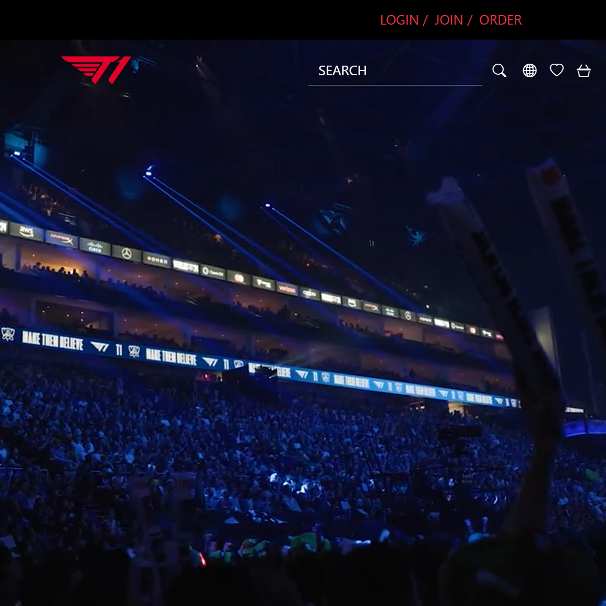

### A Misleading Name
Originally, when I first heard of the phrase "design patterns", I thought more about code legibility. Certain classes I've taken throughout my CS career has stressed the importance of making sure your code is easy to read and understand, because when you work in a group on the same project, you want everything to be cohesive and easy to edit. In that way, design patterns are similar in that they are meant to ensure efficient functionality, but it's a lot more than putting comments on your code for humans to read.

### Not Everyone Codes This Way
Surprisingly, I struggled to write about my experience with design patterns. Out of most of the skills I've learned over the course of this semester, design patterns were a concept that my brain often went into automode for. Understanding how to write code that is structured and easy to understand, devoid of errors using the same reusable solutions, and practicing these habits when you write code come more naturally to me than others. I like writing code in a structured, somewhat simple way, which has led me to naturally adopting better habits with design patterns. What surprised me, however, was realizing that not everyone writes code this way.

I assumed that when people learn how to write code, they learn in a somewhat structured way (whether that be in the classroom or confined to a specific project) and would leave notes for themselves so they could go back and easily remember what they've done. Since I have a somewhat poor memory, this is what I do for myself (and it makes it so much easier to go back and edit or just read what I've done). However, when I started working with other students on small coding projects (specifically in one of my 200 level classes), I realized their code was often hard to read and written in a way that made it difficult to fix errors or bugs. It was quite a shock to me.

Even though I feel like I didn't have much to write about in terms of revelations, I do want to keep learning more design patterns to make my code even more efficient and legible. Finding different ways to fix errors and format code is something I really enjoy and it makes me happy to see that my code is easy to understand.
