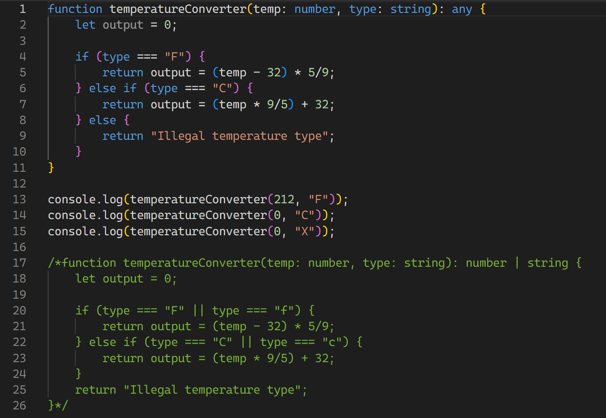

     
### From Software Development
Now I know the title may be a little infuriating to some people, because *of course* there's a difference between software development and software engineering. I have only delved into the world of software development myself, and I have a few friends who tell me about their wildly different experiences as computer engineering majors; however, one of the few classes comptuer science and computer engineer majors share is ICS 314: Software Engineering.

### To Software Engineering
I do not know much about software engineering at all. All I really understand is the fundamentals of a computer, such as the CPU, RAM, etc. A bad habit of mine is also that I go into most classes blind; I hardly prepare in advance for whatever future classes I may have, so I am completely unaware as to what I will be covering in my ICS 314 class. However, I have heard from friends who have taken the class before that there is HTML involved, which I find quite fun. When it comes to web design, I am very excited to gain and develop more skills that will help in the creative process. As long as there are some fun, creative projects ahead, I will continue to look forward to this class every wekk.

Understanding how a device operates and computes the inputs it receives is a valuable skill, especially when you're fixing or tweaking it. I often know the steps to get a coding job done, but rarely know why or how it works. That level of intentionality is what I am missing, so I hope that taking a class in software engineering will reinforce the basics in me, as well as help me to understand computer operations on a more fundamental level. 

*AI was not used in the making or revising of this essay.*
