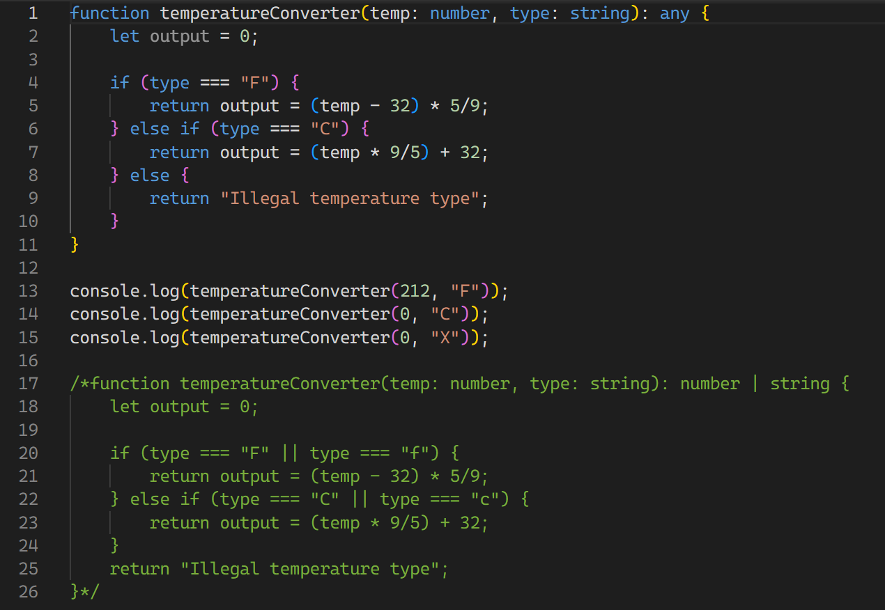

     
## Hello TypeScript
I never knew about TypeScript until I started my journey in ICS 314, also known as software engineering. My experience with coding stopped at JavaScript, C/C++, and HTML/CSS if you counted that sort of thing. Thankfully, TypeScript was very intuitive to learn, having background knowledge in other languages. In my opinion, it is a very beginner-friendly language, having many easy-to-understand concepts and vocabulary. As for whether or not it is a good software engineering language, I do not believe I have enough experience or knowledge to answer.

TypeScript, in addition to being easy to pick up, was very fun to learn. We went over several videos and exercises at home that covered how to code in TypeScript, which were all very enjoyable. In addition to the homework, there was also a practice WOD where we created a function to calculate temperature in both Celcius and Fahrenheit. It was a very fun exercise, and I felt more confident in my understanding of the language after that day.

## Growing Pain With WODs
WODs, otherwise known as "Workout of the Day", are quite a new experience for me. In my opinion, they are very similar to pop quizzes, since you don't know what question you will be asked until it is revealed in-class, and it covers material we learned throughout the week. Being not very fluent in coding languages, TypeScript especially, WODs add an extra layer of anxiety to the class. The pressure of a time limit usually results in me forgetting all relevant information needed for the exercise. Best case scenario: it is a little demoralizing. I have never reaped many benefits from timed exercises, but I do not wish to complain and only hope it at least motivates me to study hard in advance.

## Conclusion
Overall, I'm quite excited to see what lessons are in store when it comes to learning more about software engineering. As a computer science major specifically, I have not delved into the engineering aspect of technology all that much. So I am eagerly waiting to see what the next few months bring and what fun projects are coming up next.
