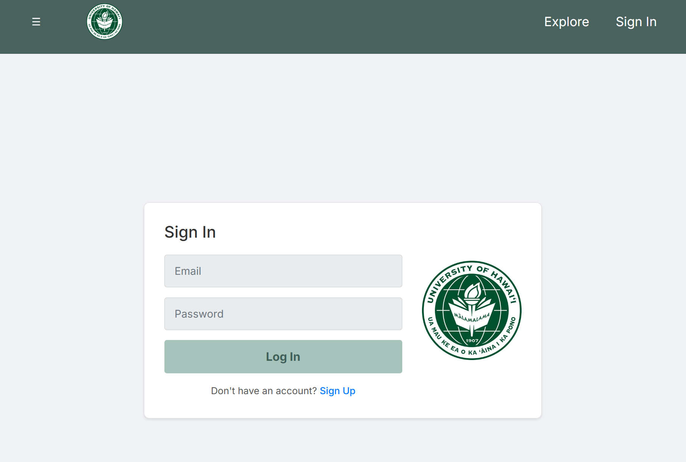
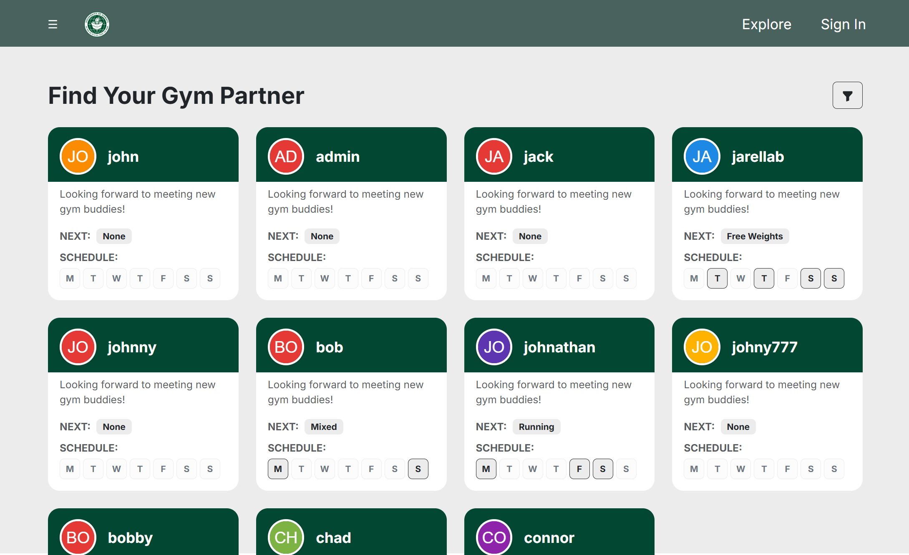
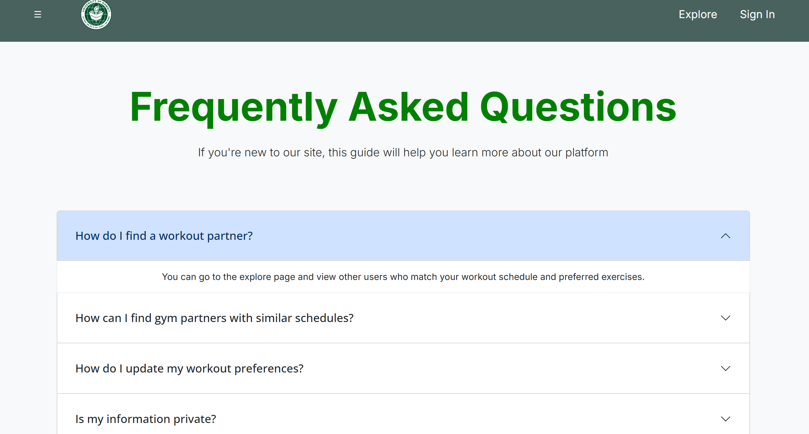

  
  
  

This website was a group project as a final for our ICS314: Software Engineering course. To give more context, we split into groups of 4-5 people and had to create a website design and implement it before the semester ended. We had to use whatever we learned throughout the class in our website, and we had approximately one month to do so. I teamed up with some friends, and we decided to create a website we dubbed "Gym Meet" or "Gym Buddy".

The purpose of the website was to allow University of Hawai'i at Manoa students to create an account, customize it with their workout preferences and schedule, and then be able to find other students who match their schedule/workout routine to go to the gym with. We found that many students who don't normally go to the gym often feel intimidated by the surroundings or don't know what to do. Having a friend (or friends) to go with makes the experience a lot easier and more enjoyable, but sometimes the friends you know don't have the same free periods you do. This is where Gym Meet comes in.

Over the course of the month (April to May), we drew up drafts of the pages, figured out what kind of features we needed to implement, programmed, bug tested, and connected a database to our website. We divided tasks up to increase efficiency, and had meetings several times a week to keep track of progress and update the other team members on what we're doing. We also kept track of how long tasks took and organized it in a spreadsheet for research purposes. Towards the end, we had five students (not a part of the class) test out the website to give their unbiased thoughts and opinions on our site. There were some issues, but overall they were very impressed with the progress we'd made and only wished there were more customizable options!

The end result wasn't perfect, but for the time we had, we (the team) all agreed that we should be proud of the work we'd done and all we'd accomplished. Throughout the project, I was in charge of updating our website (linked below), implementing features into the footer, and connecting the database to the explore page so we could click on people's profile cards and redirect the user to their profile page. The latter was, by far, the most complicated task I did, especially since it was done close to the end of the project and we had so many files and folders to work around. We had some close calls with the website not working, but in the end the website was uploaded to Vercel and able to be viewed by anyone.

You can view our team website (which includes reviews and developer/user guides) at  [UHM Gym Meet](https://gym-meet.github.io/).
