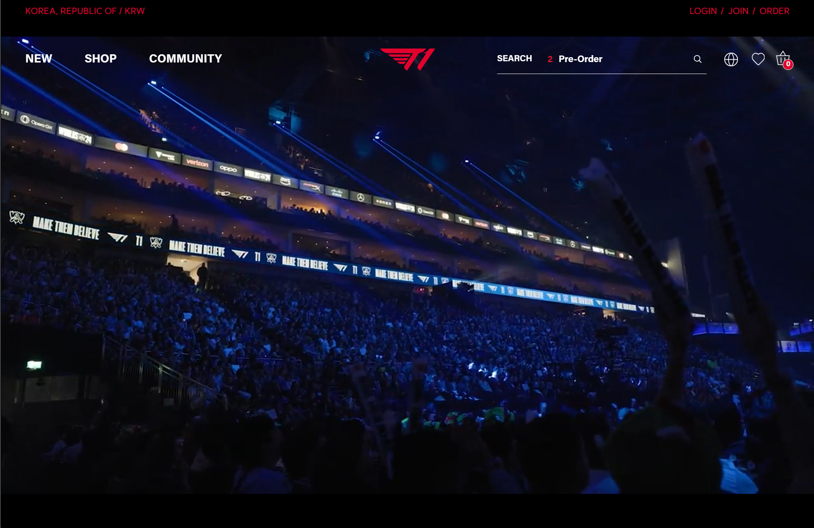

For one of my ICS314 assignments, I had to create a lookalike of a website using Bootstrap. Due to my experience teaching HTML and CSS in ICS101 classes, I already had a strong background in this type of UI framework. In addition, as it was a relatively simple design (and a website no one else picked), I decided to create a duplicate of T1's online shop. T1 is a famous League of Legends team that has some of the best players in the world. I got into watching the World Championships with my partner, so I was quite excited to get started.

The navbar was easy enough to set up, as the links didn't have to work by the project's deadline; however, I had some trouble accurately spacing the logo and the menu options in a similar way to the original website. Due to the different spacings and types of items I was incorporating (icons, pictures, search bar, and dropdown menus), I had to manually input the amount of spacing, adjust the sizes, and make sure each option was aligned correctly. By far, that was what I spent the most time on.

Everything else, by comparison, was simpler: I saved the custom video the website has playing in the background and inserted it into my duplicate, customized the search bar using custom CSS modifiers, and inserted all of the dropdown items to their respective menu options. I didn't get farther than that for the assignment, but it ended up looking pretty similar to the original website.

Here is some example code:

```
<!--Menu Bar-->
    <nav class="navbar navbar-expand-sm navbar-light position-absolute w-100" style="z-index: 999;">
        <div class="container-fluid d-flex justify-content-between align-items-center">
            <!--Left Options-->
            <ul class="navbar-nav d-flex">
                <li class="nav-item text-light p-3"><strong>NEW</strong></li>
                <li class="dropdown text-light p-3"><strong>SHOP</strong></li>
                <li class="dropdown text-light p-3"><strong>COMMUNITY</strong></li>
            </ul>
    
            <!--T1 Logo-->
            <div class="mx-auto">
                <a class="navbar-brand" href="#">
                    
                </a>
            </div>
    
            <!--Right Options + Search Bar-->
            <div class="d-flex align-items-center">
                <input type="search" class="form-control bg-transparent" placeholder="SEARCH" aria-label="SEARCH" aria-describedby="search-addon" />
                <span class="input-group-text border-0 bg-transparent text-light" id="search-addon">
                    <i class="bi bi-search"></i>
                </span>
    
                <ul class="navbar-nav d-flex">
                    <li class="nav-item"><i class="bi bi-globe2 text-light p-2"></i></li>
                    <li class="nav-item"><i class="bi bi-heart text-light p-2"></i></li>
                    <li class="nav-item"><i class="bi bi-basket3 text-light p-2"></i></li>
                </ul>
            </div>
        </div>
    </nav>
```
