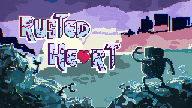

### I'm A Bright Kid
A couple years ago, I was a teaching assistant for a youth theater group called I'm A Bright Kid Foundation, named after it's founder, Ron Bright. He was a well-known director amongst the theater troupes in Oahu, specifically for his cheerful and kind nature, as well as his talent for uniting the cast under one goal: to tell the story. I was fortunate enough to experience being directed by the current staff members when I was in high school, and now they've called me back (along with some of my peers) to help TA during the summer.

For me, theater was what helped me to find confidence in myself, and find friends who would support me through all the rough times I would go through. So I felt it only natural to return and offer the chance to experience that self-discovery to other kids. That was what I thought anyway.

### Respect
In reality, I found out how hard all of the teachers worked to put on a show for the kids, and how stressful their schedules really were. A lot of the times they had to play it by ear and improvise the day of, since they wouldn't know how far the kids would go in terms of learning a new song or dance. In addition, there were a good 40+ kids in the program, and only five or so teachers. Most of them were school teachers, so they knew how big classes could get, but even then it can be difficult some days.

After experiencing two months on the opposite side, my respect and admiration for the teachers grew exponentially. Looking back on my time in the program, I thought they had everything so put-together. Their confidence and positive spirits really instilled a similar feeling within me, and pushed me to focus on getting the performance down.

### Putting on a Show

Source: <a href="https://uhmanoagamedev.itch.io/rusted-heart"><i class="link to itch.io"></i></a>
